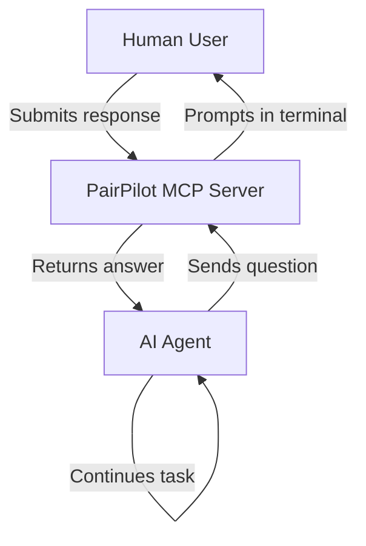

# PairPilot MCP
*Your co-pilot for coding, questions, and continuous feedback.*

PairPilot is standalone Model Context Protocol (MCP) server that enables AI agents to request human feedback through an enhanced command-line interface, without interrupting the main conversation flow.

[](https://modelcontextprotocol.io)
[](https://github.com/dsouzajude/pair-pilot-mcp)


## Problem Statement

AI agents often need human input for clarifications, confirmations, or choices during task execution. Using the main chat interface for every small question wastes tokens, breaks user flow, and clutters the conversation. This MCP server provides a dedicated "side channel" for efficient human-AI micro-interactions.

## What It Does

PairPilot acts as a bridge between a human developer and an AI agent, allowing real-time feedback through a dedicated CLI interface. This ensures clear, low-latency communication without cluttering the main chat.

- **Standalone Service**: Runs independently from AI agents, accessible via [HTTP/SSE](https://modelcontextprotocol.io/docs/concepts/transports#server-sent-events-sse).
- **Enhanced CLI**: Uses `rich` for beautiful terminal output and `questionary` for smooth interactions.
- **Three Question Types**: Free-form text, yes/no confirmations, and multiple-choice selections.
- **Docker Ready**: Containerized for easy deployment in any environment.

## How It Works

1. The AI agent encounters ambiguity or needs confirmation.
2. It sends a question to the MCP server using a registered tool.
3. The MCP prompts the human user in the terminal.
4. The user responds, and the answer is sent back to the agent.
5. The agent continues the task using that input.



## Available Tools

- **`request_free_form_input(question: str)`**
  - Asks for text input.
  - Returns: `str` (the user's textual response).
- **`request_yes_no_input(question: str)`**
  - Asks for yes/no confirmation and optional comments.
  - Returns: `dict` (e.g., `{"answer": True, "comments": "Looks good."}`)
- **`request_multiple_choice_input(question: str, options: list)`**
  - Presents choices and allows optional comments.
  - Returns: `dict` (e.g., `{"selection": ["Option A", "Option C"], "comments": "A and C are best."}`)
  - If no options are provided by the agent, returns `{"selection": [], "comments": "ERROR_NO_OPTIONS"}`.

## Demo


## Implementation Details

### Project Structure

```
pair-pilot-mcp/
├── src/
│   ├── main.py           # MCP server with tool definitions
│   └── cli_handler.py    # User interaction logic
├── Dockerfile            # Container configuration
├── requirements.txt      # Python dependencies
└── README.md
```

### Dependencies

- **Python 3**
- **mcp** - Model Context Protocol framework
- **questionary** - Interactive CLI prompts
- **rich** - Enhanced terminal output

## Running the Server

### Prerequisite

Clone the repository:

```bash
>> git clone https://github.com/dsouzajude/pair-pilot-mcp.git
```

### Environment Variables

| Variable Name | Default Value |
| ------------- | ------------- |
| HOST          | `0.0.0.0`     |
| PORT          | `8100`        |

### Using Docker (Recommended)

> See [docker-compose.yaml](.devcontainer/docker-compose.yaml) for reference configuration.

> Also available in [Docker Hub](https://hub.docker.com/r/dsouzajude/pair-pilot-mcp).

```bash
# Change directory to pair-pilot-mcp
>> cd pair-pilot-mcp

# Build the image
>> docker build -t pair-pilot .

# Run the container
>> docker run -it --rm -p 8100:8100 \
                  -e HOST="0.0.0.0" \
                  -e PORT="8100" \
                  --name pair-pilot \
                  pair-pilot

# Or alternatively, skip the build and run with the image hosted on Docker Hub
>> docker run -it --rm -p 8100:8100 \
                  -e HOST="0.0.0.0" \
                  -e PORT="8100" \
                  --name pair-pilot \
                  dsouzajude/pair-pilot-mcp:latest

# Or alternatively build and run using docker compose
>> cd .devcontainer
>> docker compose up --build --remove-orphans pair-pilot

# Then attach to the docker container to connect to the Terminal session
# for interactive pair piloting. You can detach by pressing Ctrl+C.
>> docker attach --detach-keys="ctrl-c" pair-pilot
```

### Local Development

```bash
# Install dependencies
>> pip install -r requirements.txt

# Run the server - which will also hook you on to the Terminal session
# for interactive pair piloting.
>> python -m src.main
```

The server will start on `http://localhost:8100/sse`.

### Using the Test Client

We have a test client in [test_client.py](test_client.py) to help with local
development. It will connect to the server and automatically call the three tools sequentially with predefined inputs. You'll see the client's requests and the server responses printed in the client's terminal. The PairPilot server terminal will show the interactive prompts. Use the following command to run the client:

```bash
# Run the client
# The `MCP_SERVER_URL` environment variable is required and defaults to `http://localhost:8100/sse`
>> MCP_SERVER_URL=<MCP_SERVER_URL> python test_client.py

Attempting to connect to MCP server at http://host.docker.internal:8100/sse...
Session initialized. Available tools from server:
['request_free_form_input', 'request_yes_no_input', 'request_multiple_choice_input']

--- Testing: request_free_form_input ---
Client: Asking free-form question: 'What is your favorite programming language?'
Server Response: [TextContent(type='text', text='Python', annotations=None)]

--- Testing: request_yes_no_input ---
Client: Asking yes/no question: 'Do you enjoy using MCP?'
Server Response: [TextContent(type='text', text='{"answer": true, "comments": "MCP is great!"}', annotations=None)]

--- Testing: request_multiple_choice_input ---
Client: Asking multiple-choice question: 'Which topic do you want to discuss?' with options: ['Technology', 'Science', 'Art']
Server Response: [TextContent(type='text', text='{"selection": ["Technology", "Science"], "comments": "Let's start with these two."}', annotations=None)]

--- Test client finished ---
```

## AI Agent Integration

> Note: Before using the MCP, ensure that it is run locally following the above commands. It is intended to act as a standalone server for the Agent to connect to it. If it is not running already, the Agent will fail to connect to the MCP and it won't work.

Add this configuration to your AI agent's MCP settings:

### Cursor AI (`.cursor/mcp.json`)

```json
{
  "mcpServers": {
    "pair-pilot": {
      "url": "http://localhost:8100/sse",
      "description": "Pair Pilot - Your co-pilot for coding, questions, and continuous feedback"
    }
  }
}
```

### Github Copilot (`.vscode/mcp.json`)

```json
{
    "servers": {
        "pair-pilot": {
            "url": "http://localhost:8100/sse"
        }
    }
}
```

### Other AI Agents

Most MCP-compatible agents use similar configuration. Adjust the format as needed for your specific agent.

### Prompt Enineering

You can reuse the prompt in [prompts/clarify-before-coding.md](prompts/clarify-before-coding.md) for the AI agent to use in order to invoke the tools. Your prompt can look something like this:

> *Throughout this session, make sure to follow all instructions in @clarify-before-coding.md to interact with me for continuous feedback and to get clarity by using the pair-pilot MCP*.

## Testing

Run the unit tests with pytest:

```bash
# Install test dependencies
>> pip install -r requirements.txt

# Run all tests
>> pytest

# Run with verbose output
>> pytest -v

# Run specific test file
>> pytest tests/test_cli_handler.py
```

## Want to Contribute?

See [CONTRIBUTING.md](CONTRIBUTING.md)
