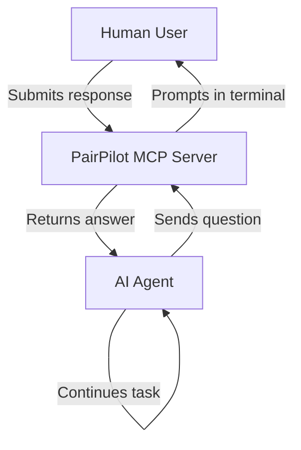

# PairPilot MCP
*Your co-pilot for coding, questions, and continuous feedback.*

PairPilot is standalone Model Context Protocol (MCP) server that enables AI agents to request human feedback through an enhanced command-line interface, without interrupting the main conversation flow.

## Problem Statement

AI agents often need human input for clarifications, confirmations, or choices during task execution. Using the main chat interface for every small question wastes tokens, breaks user flow, and clutters the conversation. This MCP server provides a dedicated "side channel" for efficient human-AI micro-interactions.

## What It Does

- **Standalone Service**: Runs independently from AI agents, accessible via [HTTP/SSE](https://modelcontextprotocol.io/docs/concepts/transports#server-sent-events-sse)
- **Enhanced CLI**: Uses `rich` for beautiful terminal output and `questionary` for smooth interactions
- **Three Question Types**: Free-form text, yes/no confirmations, and multiple-choice selections
- **Docker Ready**: Containerized for easy deployment in any environment

Here’s a concise new section you can add to your `README.md` that explains the flow between the human user, the MCP server, and the AI agent, along with a **Mermaid flow diagram**:

---

## System Flow: Human ↔ MCP ↔ AI Agent

PairPilot acts as a bridge between a human developer and an AI agent, allowing real-time feedback through a dedicated CLI interface. This ensures clear, low-latency communication without cluttering the main chat.

### How It Works

1. The AI agent encounters ambiguity or needs confirmation.
2. It sends a question to the MCP server using a registered tool.
3. The MCP prompts the human user in the terminal.
4. The user responds, and the answer is sent back to the agent.
5. The agent continues the task using that input.



## Project Structure

```
pair-pilot-mcp/
├── src/
│   ├── main.py           # MCP server with tool definitions
│   └── cli_handler.py    # User interaction logic
├── Dockerfile            # Container configuration
├── requirements.txt      # Python dependencies
└── README.md
```

## Dependencies

- **Python 3**
- **mcp** - Model Context Protocol framework
- **questionary** - Interactive CLI prompts
- **rich** - Enhanced terminal output

## Running the Server

### Using Docker (Recommended)

```bash
# Build the image
docker build -t pair-pilot .

# Run the container
docker run -it -p 8100:8100 --rm --name pair-pilot  pair-pilot

# Or in docker compose
docker compose up --build --remove-orphans

# Then attach to the docker container to connect to the Terminal session
# for interactive pair piloting.
docker attach pair-pilot
```

### Local Development

```bash
# Install dependencies
pip install -r requirements.txt

# Run the server - which will also hook you on to the Terminal session
# for interactive pair piloting.
python src/main.py
```

The server will start on `http://localhost:819=00/sse`

## AI Agent Integration

> Note: Before using the MCP, ensure that it is run locally following the above commands. It is intended to act as a standalone server for the Agent to connect to it. If it is not running already, the Agent will fail to connect to the MCP and it won't work.

Add this configuration to your AI agent's MCP settings:

### Cursor AI (`.cursor/mcp.json`)

```json
{
  "mcpServers": {
    "pair-pilot": {
      "url": "http://localhost:8100/sse",
      "description": "Pair Pilot - Your co-pilot for coding, questions, and continuous feedback"
    }
  }
}
```

### Other AI Agents

Most MCP-compatible agents use similar configuration. Adjust the format as needed for your specific agent.

### Prompt Enineering

You can add the following instructions for the AI agent to invoke the tools:

```markup
# Guide to Clarifying Before You Code
Whenever you encounter ambiguity, need a decision, or could benefit from the user's guidance before continuing, pause and use the `pair-pilot` MCP server to ask for clarification. Always use one of the following tools:

- `request_free_form_input(question: str)` — for open-ended questions or feedback.
- `request_yes_no_input(question: str)` — for simple confirmations.
- `request_multiple_choice_input(question: str, options: list)` — when offering a defined set of paths.

After receiving a response, continue the task accordingly and recheck with the user before finalizing if needed.

```

## Available Tools

- **`request_free_form_input(question: str)`** - Ask for text input
- **`request_yes_no_input(question: str)`** - Ask for yes/no confirmation
- **`request_multiple_choice_input(question: str, options: list)`** - Present choices

## Testing

Run the unit tests with pytest:

```bash
# Install test dependencies
pip install -r requirements.txt

# Run all tests
pytest

# Run with verbose output
pytest -v

# Run specific test file
pytest tests/test_cli_handler.py
```

The tests cover:
- CLI handler functions with mocked questionary interactions
- MCP tool functions end-to-end with mocked CLI calls
- Error handling for edge cases (cancelled inputs, empty options)
